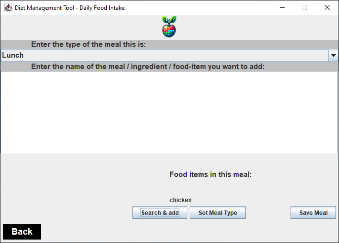

# Product Demonstration Report

## Welcome Screen

This is our welcome screen of the application with options to log in, sign up and a forgot password button.

## Forgot Password Screen

This is our forgot your password? screen, it prompts the user to enter their full name and after verification, it displays the users username and password.

## Disclaimer Screen

This is disclaimer screen which guides the user on the type of username and password to choose.

## Sign Up Screen

This is the sign up screen which helps the user to sign up if they are a new user and registers them in the database.

## Error Checks For Sign Up Screen

This is the first error check which makes sure that the user name is between 4-16 characters and does not contain any special characters.

This is the second error check which makes sure the password is between 8-20 characters.

## Sucessful Sign Up and Auto-Login Screen

This screen pops up when the user sucessfully logs in to the application and auto logs them in the application.

## Welcome Screen

This is the main screen of the application which displays all the options.

## Nutrition Recommendation Calculator

This is the nutrition recommendation calculator, this takes the users input and displays the calories, macro and micro nutrients needed according to the users needs.

## Age Check

This is the age check which checks if the user is above 18 and has a reasonable age.

## Weight Check

This is the weight check and it checks if the weight is under a certain limit and is reasonable.

## Height Check

This is the height check and it checks if the height is under a certain number.

## Form Submit Sucessfully

This screen pops up when all the data entered in the nutrition recommendation calculator has bypassed all the checks and is submitted in the application.

## Result

This is the screen that displays all the calorie and health information for the user according to the data that the user had entered in the previous screen.

## Daily Food Intake Screen

This is the screen that the user will use to add foods and meals using an API, so the calories for the user can be tracked and predicted. It also shows some preview text which helps the user to enter information.

## Types Of Meals

This shows the different types of meals the user can select depending on the type of meal.

## Input In The Meal:

This screen shows the user entering the food they want to add to their meals.

## Meal Type Set Button

This screen shows the confirmation that the meal type has been sucessfully set.

## Food Item Added

This screen shows that the food item has been sucessfully added to the application.

## Food Items Added 

This screens shows that the food has been added to the meal as it can be seen.

## Meal Saved

This screen shows that the meal has been saved sucessfully and the user can proceed to generate their report.

## Report Generation Screen

This is the main report generation screen, which has the options to generate report, go back and view the generated report in your browser.

## Report Sucessfully Generated

This screen informs the user that their report has been generated from a specific date stamp with their user name.

## Report View Sucess

This screen pops up when the user clicks on the view report button and it informs the user that the report it being opened in their local browser.

## Report

This screen shot shows how the report looks in the browser with mix meals and food items.

## Prediction and Graphs

This screen shows all the graphs, a calorie predictor and a pie chart showing the meals distribution.

## Meal Distribution
The next three screen shots show how the meals are also divided by Breakfast, Lunch and Dinner as well.

**Breakfast:**

**Lunch:**

**Dinner:**

## End Of Report

This is the end of the report.
