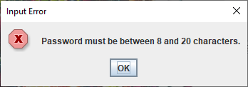
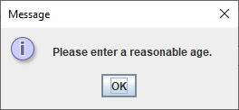

# Test report  

### Testing performed

Numerous error checking methodologies and checks were implemented and the result are as follows:

## Error Checks For Sign Up Screen

This is the first error check which makes sure that the user name is between 4-16 characters and does not contain any special characters.

This is the second error check which makes sure the password is between 8-20 characters.

## Age Check

This is the age check which checks if the user is above 18 and has a reasonable age.

## Weight Check

This is the weight check and it checks if the weight is under a certain limit and is reasonable.

## Height Check

This is the height check and it checks if the height is under a certain number.

## Food Item Not Found Check

This is to check if the item the user is searching exists or not, if it exists it is added to their meal and if not this error is presented to the user.

## Report Not Found

This is an error check implemented to catch if the file is not found for the user.

### Auto Test

We did not perform any auto testing as all the testing was done manually. No JUnit tests were performed instead we did:

*-Real People Testing*

*-Debugging*

*-Print Statements*

*-Module Testing*

After several hours and attempt to break the application, we were sucessfully able to get a flawless application, totally bug-free!